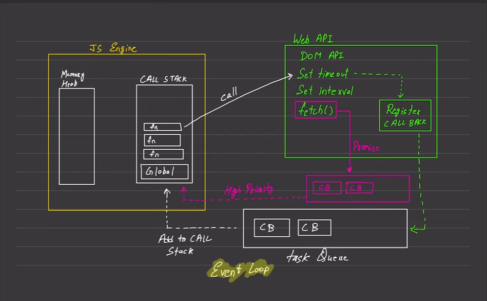

Async in JavaScript

-> A synchronous language by default, first a block of code, then next, then next and so on...
-> A single threaded language, by default and slow. Code runs line by line and it has one call stack. It is asynchronous capable with the usuage of event loops and Web API's. 
->Each operation waits for the last one before executing

Blocking Code and Non-Blocking Code

->Blocking code blocks the execution of the program (read file sync) while the second one does not (read file async)

When there is asynchronous code to execute, web API and other environments are used. 

Flow: 

The code is running, goes onto call stack and it detects an async function being called (for ex setTimeOut etc). So that specific code, which has async function, goes to web api and the rest of the code keeps on running.

All the tasks that requires web api are sent to web api and register callback registers all these tasks. Then the taks is executed (async tasks) and their callback is stored in callback queue or task queue.

Callback might go to either the task queue (for ex setTimeOut) or the high priortiy queue (or microtask queue or promise queue) (promise) depending on its priority.

Then the event loop continuously checks for whether the stack is empty, if it is, it pushes the task into stack and it executes first microtasks and then callback tasks

Async means the main thread will not be blocked while it runs. Some requests do involve web, some do not. JS can handle because of browser and node.js env
